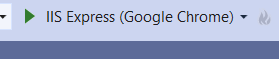
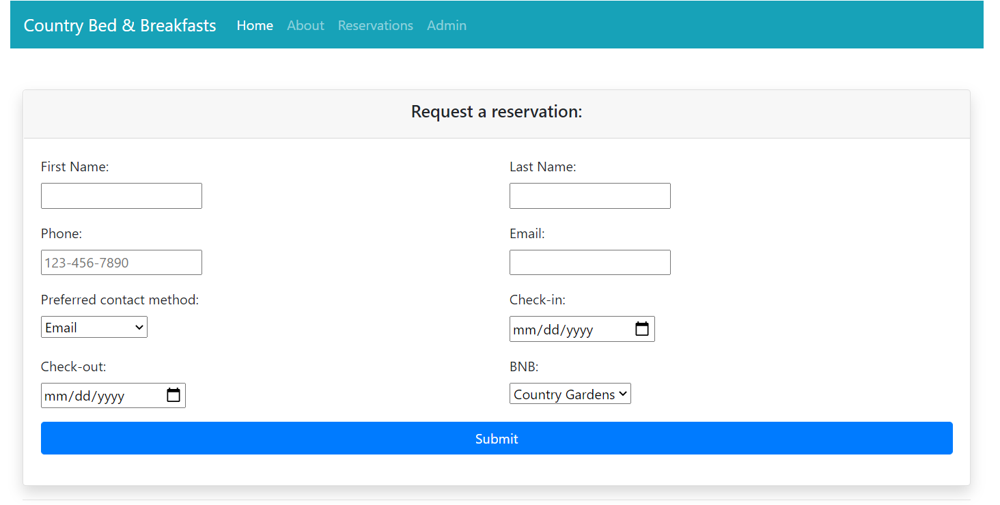
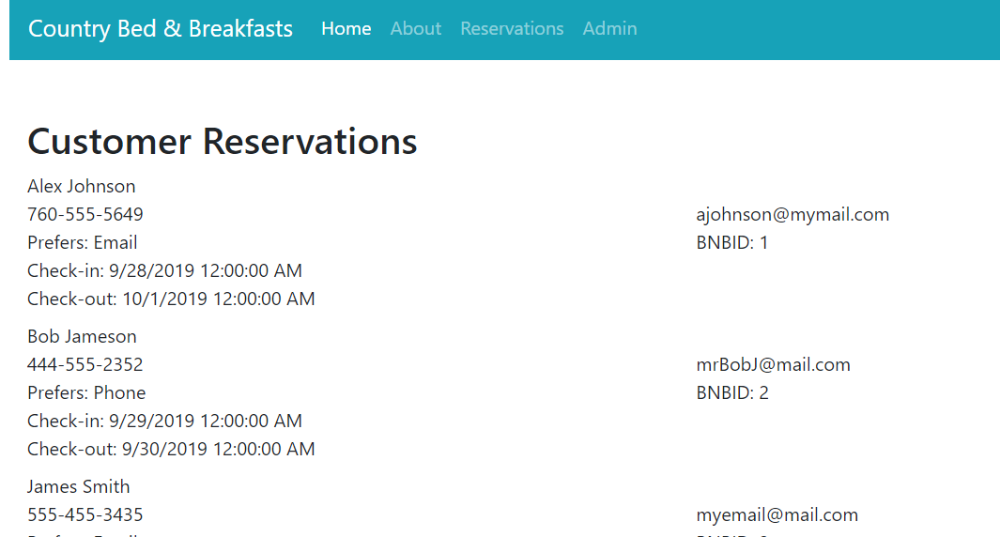

# BNB Demo
1. To run this program, click on BNB.sln to run it in Visual Studio.
2. From Visual Studio, press F5 or click the Play button at the top to start the website.

3. From the Reservations tab, you can submit your own reservation. 
 

4. From the Admin tab, you can view all submissions. New submissions will appear at the bottom of the list.

